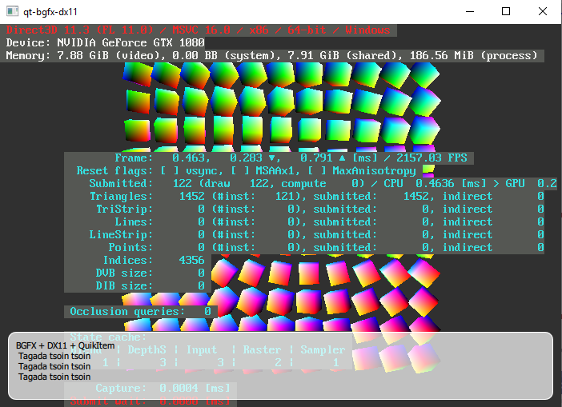

# Qt + bgfx with multiple backend

Since Qt 5.14, it's now possible to select a RHI (OpenGL/DX11/Metal/...) to render QML scene.

This project experiment the interoperability of the new Qt RHI with bgfx in a multi window / multi QML scene context.

# Dependencies

You need at least Qt 5.14 

> git clone https://github.com/VirtualGeo/qt-rhi-bgfx 
> mkdir build && cd build 
> cmake .. 

Build bgfx
> git clone --recurse-submodules https://github.com/VirtualGeo/bgfx.cmake 
> cd bgfx.cmake/bgfx 
> git pull 

Back to the bgfx.cmake directory and generate solution. 

> mkdir build/x64 
> cd build/x64 
> cmake ../.. -DBGFX_BUILD_EXAMPLES=OFF -DBGFX_BUILD_TOOLS=OFF -DCMAKE_INSTALL_PREFIX=../../bgfx-install/x64 
> cmake --build . 
> cmake --install ../../bgfx-install/x64 